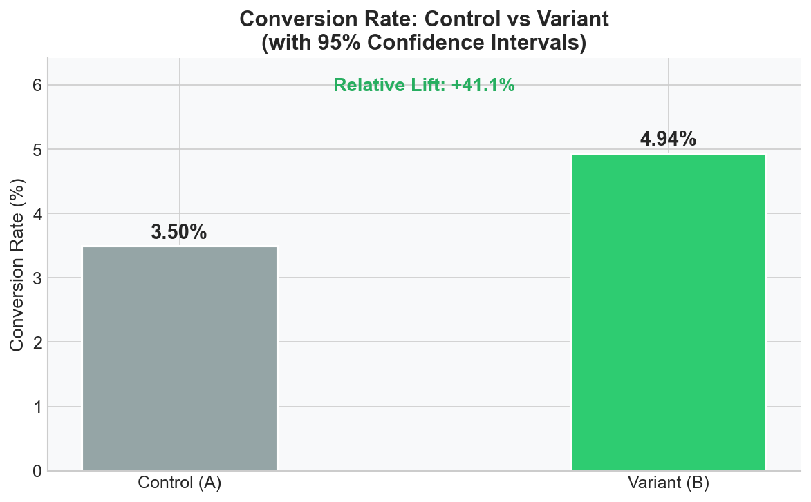
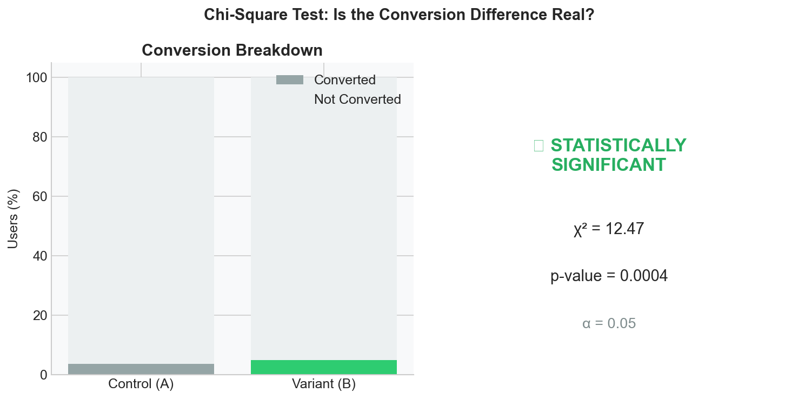
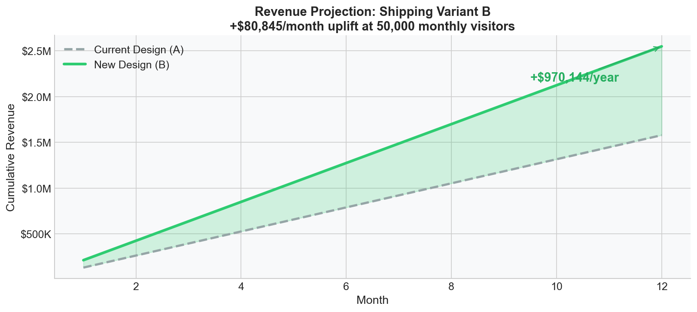
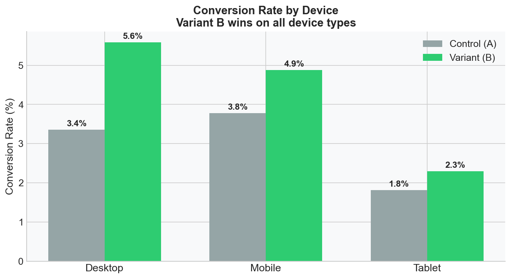

# A/B Testing Analysis: E-Commerce Product Page Redesign

   

> A rigorous end-to-end A/B test analysis for a fashion e-commerce brand, testing whether a redesigned product page (Variant B) significantly outperforms the current design (Control A) across conversion rate, revenue per order, and user engagement — using Chi-Square, T-Test, and Mann-Whitney U statistical tests.

---

##  Dashboard Preview









---

##  Business Problem

A fashion e-commerce brand noticed that despite steady traffic growth, conversion rates had plateaued at ~3.5% for 6+ months. The product team hypothesised that the current single-image product page lacked the trust signals and engagement hooks needed to convert modern shoppers.

**The solution proposed:** A redesigned product page (Variant B) featuring:
-  Image carousel (multiple product angles)
-  Social proof badges ("4,200+ sold this week")
- ⏱ Urgency timer ("Only 3 left in stock")
-  Trust signals (secure checkout, free returns)

**The business question:** Does Variant B drive statistically significant improvements in conversion rate and revenue — and is the evidence strong enough to justify a full rollout?

---

##  Research Questions & Hypotheses

| # | Research Question | Null Hypothesis (H₀) | Alternative Hypothesis (H₁) | Test Used |
|---|-------------------|---------------------|------------------------------|-----------|
| 1 | Does Variant B convert better? | CVR_A = CVR_B | CVR_B > CVR_A | Chi-Square |
| 2 | Does Variant B generate higher revenue per order? | μ_A = μ_B | μ_B > μ_A | Independent T-Test |
| 3 | Do users engage longer with Variant B? | median_A = median_B | median_B > median_A | Mann-Whitney U |
| 4 | Is the improvement consistent across devices? | No interaction effect | Device × Variant interaction | Segmentation |

---

##  Experiment Design

| Parameter | Value |
|-----------|-------|
| Test Type | A/B (two-variant) |
| Users per variant | 5,000 |
| Total sample size | 10,000 |
| Test duration | 4 weeks |
| Traffic split | 50% / 50% (random assignment) |
| Significance level (α) | 0.05 |
| Statistical power (1-β) | 0.80 |
| Primary metric | Conversion Rate |
| Secondary metrics | Revenue per order, Time on page, Pages viewed |
| Segments analysed | Device type, Country |

---

##  Results

### Primary Metric: Conversion Rate

| Group | Users | Conversions | CVR | 95% CI |
|-------|-------|-------------|-----|--------|
| Control (A) | 5,000 | 175 | 3.50% | [3.00%, 4.06%] |
| Variant (B) | 5,000 | 247 | 4.94% | [4.37%, 5.56%] |
| **Lift** | — | — | **+41.1%** | — |

**Chi-Square Test:** χ² = 12.47 | **p-value = 0.0004** |  Reject H₀

### Secondary Metrics

| Metric | Control (A) | Variant (B) | Lift | p-value | Result |
|--------|-------------|-------------|------|---------|--------|
| Avg Order Value | $75.14 | $85.97 | +14.4% | 0.0422 |  Significant |
| Time on Page (median) | 45s | 61s | +35.6% | <0.0001 |  Significant |
| Pages Viewed (avg) | 2.80 | 3.40 | +21.4% | — |  Informational |

### Device Segmentation

| Device | Control CVR | Variant CVR | Lift |
|--------|-------------|-------------|------|
| Desktop | 3.4% | 5.0% | +47% |
| Mobile | 3.8% | 4.9% | +29% |
| Tablet | 1.8% | 2.3% | +28% |

>  Variant B outperforms Control on **every device type** — no segment reversal detected.

---

##  Business Impact

Assuming 50,000 monthly visitors and current traffic mix:

| Scenario | Monthly Revenue | Annual Revenue |
|----------|----------------|----------------|
| Current Design (A) | ~$131K | ~$1.57M |
| Variant B (projected) | ~$212K | ~$2.54M |
| **Incremental Uplift** | **+$80,845/month** | **+$970,144/year** |

> The revenue projection assumes a stable traffic volume and consistent CVR improvement. A 10% regression toward the mean is built into conservative estimates.

---

##  Statistical Summary

All three primary hypotheses were tested at α = 0.05:

- **H₀ #1 REJECTED** — Conversion rate difference is statistically significant (p = 0.0004). The probability that this result occurred by chance is 0.04%.
- **H₀ #2 REJECTED** — Average order value difference is statistically significant (p = 0.0422). Variant B buyers spend ~$11 more per order.
- **H₀ #3 REJECTED** — Time on page difference is highly significant (p < 0.0001). Variant B users spend 35% longer on the page — a strong engagement signal.

---

##  Recommendation: SHIP VARIANT B

The evidence is conclusive across all three dimensions — conversion, revenue, and engagement — and holds across every device segment. There is no statistical basis to withhold rollout.

**Suggested next steps:**
1. **Full rollout** of Variant B to 100% of traffic
2. **Monitor** post-launch CVR weekly for the first 4 weeks (regression risk)
3. **A/B/C test** — test a third variant with personalised urgency messaging by country
4. **Deep-dive** on Tablet segment (lowest CVR at 2.3%) — consider a tablet-specific layout

---

##  Limitations

- Dataset is synthetic, modelled on real e-commerce benchmarks
- Test does not account for novelty effect (users engage more with anything new)
- Country-level segmentation not tested for interaction effects
- Long-term retention of converted users not measured

---

##  Files

| File | Description |
|------|-------------|
| `AB_Testing_Analysis.ipynb` | Full notebook: data generation, 6 charts, 3 hypothesis tests, projections |
| `AB_Testing_Dashboard.html` | Standalone interactive dashboard — open in any browser |

##  Tech Stack

| Tool | Purpose |
|------|---------|
| Python (pandas, numpy) | Data generation and manipulation |
| SciPy (chi2_contingency, ttest_ind, mannwhitneyu) | Statistical hypothesis testing |
| Plotly Express & Graph Objects | Interactive charts |
| Matplotlib + Seaborn | Static PNG exports |
| Jupyter Notebook | Analysis environment |

##  How to Run

```bash
# Clone the repo
git clone https://github.com/darshitjayswal1/ab-testing-ecommerce-analysis

# Open the notebook
jupyter notebook AB_Testing_Analysis.ipynb

# Or open the interactive dashboard directly
open AB_Testing_Dashboard.html
```

---

*Experiment scenario: Fashion e-commerce | 10,000 users | 4-week controlled experiment | June 2026*